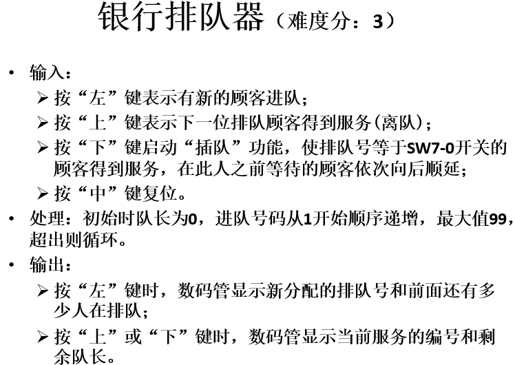

# 题目 银行排队器

* 题目要求
 

* 文件描述

```
root
|__bank.asm            #题目汇编程序
|__queue_bank          #项目文件夹
   |__bank_queue.dat   #汇编生成的机器代码
   |__queue_bank.srcs  #设计文件
      |__sources_1
      |  |__new
      |     |__mips.v  #CPU文件
      |__constrs_1
         |__new
            |__top.xdc #约束文件
```


## 关于爱情

*严格来说，这不是一切开始的地方。

*往前数一两周，那是一个风和日丽的一天。这一天，有EDA课设的介绍会。
由于转专业的原因，我的舍友和我并不是一个专业的，这就造成了我独自一人迈进大教室。
环顾四周，我坐在了一个靠中间的位置。
坦率来讲。
如果我不是独自走进那间教室，
如果我不是坐在那个位置，
如果任同学再早点找我组队，
如果，，，
这后来的一切就都不会发生。

*就是这样种种巧合碰撞在一起，

*她就坐在我旁边，但我也丝毫没有想主动找她组队的意思。
然后，她主动找我组队了
一分钟过后，任同学私聊我，我只能说我已经组好队了。

*这便是一切的开始。

*这个课设持续了一周，
还是挺难的，算是憋出来的，印象中是我自己做出来的，莫得参考

*那一周过后，我们聊天变得频繁了。

*过了一周，迎来了巨难，持续两周的几组课设，啊，也就是这个项目。
顺其自然，我们还是一队。
cpu代码是参考学长的，汇编部分是我们自己写出来的
这个汇编在老师给的题库里，算是最难的之一了
逻辑性很强，细节很多，汇编能正确完整地写出来也是实属不易。
正因如此，我们的成绩是专业前二，
她第一，我第二。

*正是由于这两周的接触，我心动了，
她也一样。
后来，我们就在一起了
13个月

*再后来，就分手了

*感谢这个项目，
让我第一次感受爱情

*想说的有很多，心情也很复杂

*但概括起来还是那9个字

*对不起
知道了
谢谢你

*人在深夜时总会多愁善感吧

*感谢这个项目，让我们在一起
也感谢EDA课设，
感谢所有的遇见
感恩所有的陪伴

# 。
